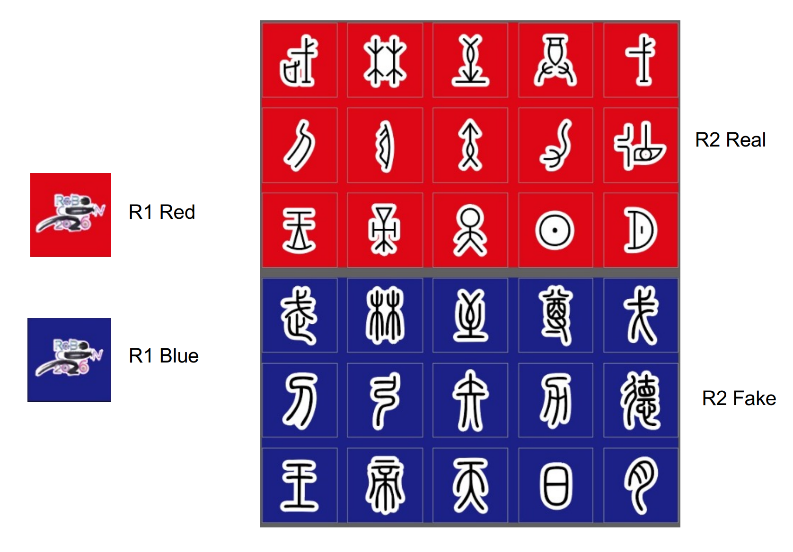

# Klasifikasi Logo ABU Robocon 2026 (Classical ML)

Klasifikasi logo Real/Fake pada kotak lomba ABU Robocon 2026 memakai classical machine learning. Data berasal dari anotasi YOLOv8 OBB (Roboflow) pada rekaman video kotak lomba dan foto manual. Objek di-crop dan diluruskan, lalu diklasifikasi ke 31 kelas (`R1`, `REAL_1` sampai `REAL_15`, `FAKE_1` sampai `FAKE_15`) dengan fitur HOG + histogram warna HSV.

<p align="center">
  
</p>


Lima algoritma dibandingkan: KNN, Naive Bayes, SVM (RBF), MLP, Random Forest.

## Dataset

Dataset lengkap (raw dan processed) tersedia untuk diunduh dari Kaggle:
[https://www.kaggle.com/datasets/raditya0/abu-robocon-2026-logo-classification-dataset/data](https://www.kaggle.com/datasets/raditya0/abu-robocon-2026-logo-classification-dataset/data)

Repo ini **tidak menyertakan dataset**.

## Struktur Folder

```
robocon2026-logo-classification/
  data/                   
    raw/                      export Roboflow (train/valid/test + labels OBB, data.yaml) dan Foto/ (foto manual)
    processed/                hasil crop-rotate per split dan per kelas, plus rejected/ (crop terlalu kecil/blur)
  pipeline/                   script tahap 0-4 (lihat "Cara Menjalankan")
  notebook/                   object_classification.ipynb, notebook tugas individu (SVM + PCA)
  results/
    reports/                  classification_report_*.txt dan results_summary.csv
    confusion_matrices/       confusion matrix per model (CSV)
    logs/                     rejected_log.csv, manual_photo_log.csv, laporan_stats.json
    contoh_gambar/            grid contoh citra keluaran notebook
    features.csv              matriks fitur seluruh citra (tidak di-commit)
  docs/
    laporan/                  laporan Dataset (.docx, .pdf) 
      assets/                 gambar laporan (confusion matrix, grid kelas, distribusi reject, HOG)
    refleksi/                 laporan refleksi notebook (.docx, .pdf)
      assets/                 gambar laporan refleksi (alur pipeline, before/after, pasangan kelas tertukar, dll)
```

## Cara Menjalankan

Semua script memakai path relatif, jalankan dari root repo.

**Dependensi.** Versi yang dipakai untuk menghasilkan hasil di bawah (Python 3.13.7):

```
pip install numpy==2.1.0 pandas==2.2.3 matplotlib==3.10.6 opencv-python==4.12.0.88 \
    scikit-learn==1.8.0 scikit-image==0.26.0 joblib==1.4.2 Pillow==10.4.0 PyYAML==6.0.2 \
    ipython==8.32.0 ipykernel==6.29.5 nbformat==5.10.4 nbconvert==7.16.6 nbclient==0.10.2
```

**Data.** Unduh dataset dari Kaggle (link di atas) dan ekstrak ke `data/processed`. Setelah diekstrak, `data/processed/` harus berisi `train/`, `valid/`, dan `test/`.

**Pipeline.** Jalankan berurutan:

```
python pipeline/01_crop_rotate.py         # crop + rotate OBB, filter ukuran/blur -> data/processed/, results/logs/rejected_log.csv
python pipeline/00_import_manual_photos.py  # foto manual -> data/processed/train/, results/logs/manual_photo_log.csv
python pipeline/02_extract_features.py    # HSV histogram + HOG -> results/features.csv
python pipeline/03_train_eval.py          # 5 model -> results/reports/, results/confusion_matrices/
python pipeline/04_report_assets.py       # gambar dan statistik laporan -> docs/laporan/assets/, results/logs/laporan_stats.json
```

Catatan urutan: `00_import_manual_photos.py` menambahkan foto ke folder kelas yang dibuat oleh `01_crop_rotate.py`, jadi 01 harus jalan lebih dulu meskipun penomorannya 00.

**Notebook.** Setelah `01` dan `00` selesai, `notebook/object_classification.ipynb` bisa dijalankan dari folder `notebook/` maupun dari root repo; folder `data/processed/` dan `results/contoh_gambar/` dicari otomatis. Eksekusi penuh sekitar 6 menit pada mesin 22 core:

```
python -m nbconvert --to notebook --execute --inplace notebook/object_classification.ipynb
```

## Ringkasan Hasil

31 kelas, 8.537 citra: train 4.876, valid 2.322, test 1.339. Terdiri dari 8.475 crop video dan 62 foto manual (seluruhnya di train); 3.832 crop video (31,14%) dan 8 foto manual (11,43%) ditolak karena terlalu kecil atau blur.

Hasil pada test set (`results/reports/results_summary.csv`):

| Model         | Valid acc | Accuracy         | Precision (macro) | Recall (macro) | F1 (macro)       |
| ------------- | --------- | ---------------- | ----------------- | -------------- | ---------------- |
| KNN           | 0,9440    | 0,9447           | 0,9446            | 0,9305         | 0,9343           |
| Naive Bayes   | 0,5715    | 0,5609           | 0,7007            | 0,6058         | 0,6140           |
| SVM (RBF)     | 0,9449    | 0,9462           | 0,9656            | 0,9282         | 0,9449           |
| **MLP** | 0,9457    | **0,9574** | 0,9551            | 0,9481         | **0,9507** |
| Random Forest | 0,9160    | 0,9291           | 0,9546            | 0,9048         | 0,9267           |

- MLP dan Random Forest di `03_train_eval.py` tidak diberi `random_state`, jadi angkanya bergeser sedikit tiap kali dijalankan ulang (KNN, Naive Bayes, SVM identik). Tabel ini adalah run yang tersimpan di `results/`.
- MLP tertinggi pada accuracy dan F1 macro (selisih F1 dengan SVM 0,0058), SVM tertinggi pada precision macro. Karena MLP tidak di-seed, selisih sekecil itu masih dalam kisaran variasi antar-run MLP sendiri.
- Menambah 36 foto manual ke train (26 menjadi 62) hampir tidak mengubah hasil: SVM accuracy 0,9455 menjadi 0,9462 (satu citra uji), F1 macro 0,9446 menjadi 0,9449.
- Naive Bayes jauh tertinggal.
- Pasangan yang paling sering tertukar antara Real dan Fake: `REAL_12` dan `FAKE_12` (`results/logs/laporan_stats.json`).

Hasil notebook (pipeline SVM + PCA) ada di bagian 9 `notebook/object_classification.ipynb`.
